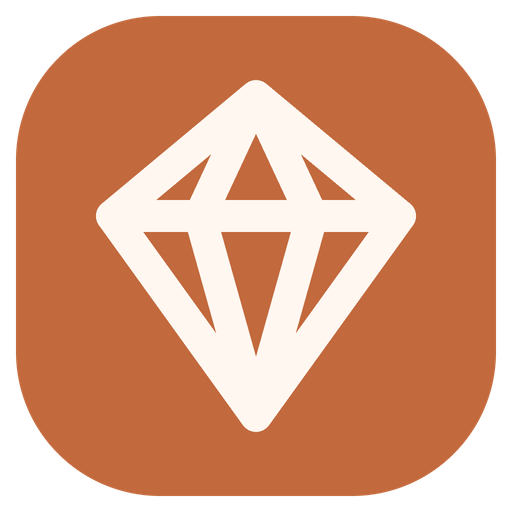
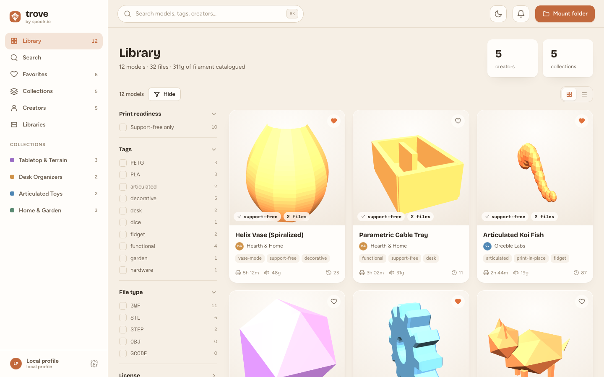
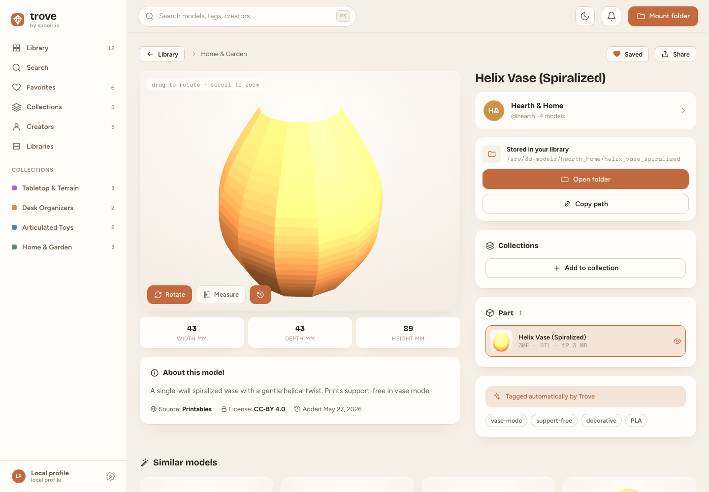
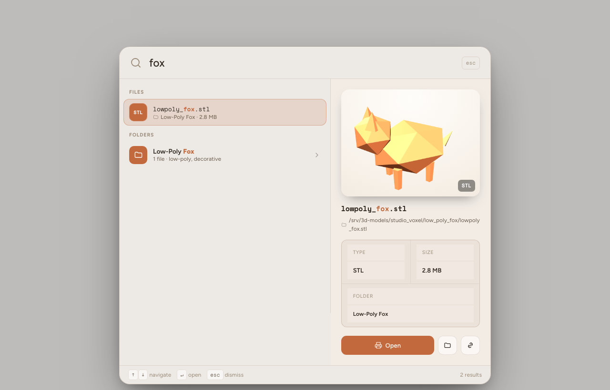
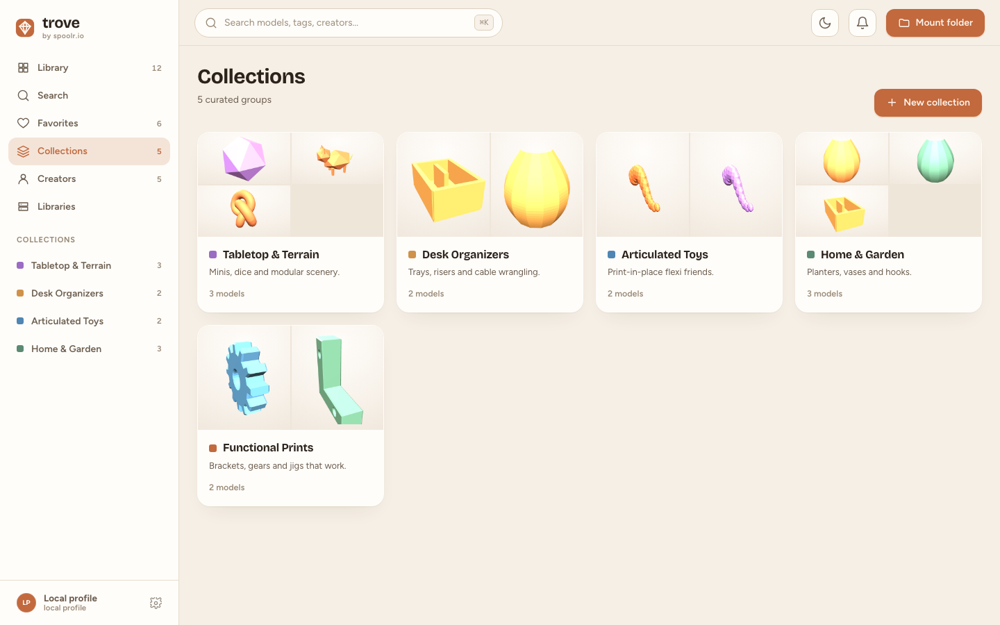
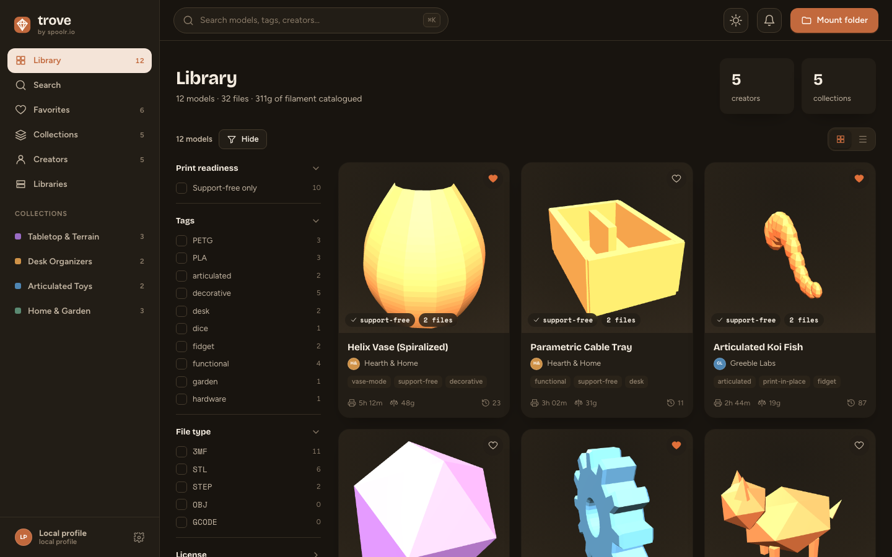

<div align="center">



# Trove

### Your 3D-print library, finally organized.

A self-hosted **desktop app** that indexes your STL / 3MF / STEP files **in place** — browse them in a real 3D viewer, search instantly, and summon any model with a global launcher. Nothing is ever moved, modified, uploaded, or downloaded.

[](https://github.com/kurenn/trove/releases/latest)
[](https://github.com/kurenn/trove/actions/workflows/release.yml)
[](LICENSE)


[**🌐 Website**](https://trove.spoolr.io) &nbsp;·&nbsp; [**⬇️ Download**](https://github.com/kurenn/trove/releases/latest) &nbsp;·&nbsp; [**🧭 Quick start**](#-quick-start)

<br/>



</div>

---

## Why Trove?

Your models are scattered across folders, drives, and a network share — `final_v3.stl`, a ZIP from a marketplace, a `Renders/` folder you forgot about. Trove points at those folders and turns them into a fast, browsable, **read-only** library. It indexes, auto-tags, renders 3D previews, and gets you to the file — then hands off to your slicer or file manager. **It never touches your files.**

## ✨ Features

- 🗂️ **Read-only indexer** — point it at any folder (local or network-mounted). A parallel walker scans fast; incremental rescans skip unchanged directories. Files stay exactly where they are.
- 🧊 **Real 3D previews** — an in-app Three.js viewer for STL / OBJ / 3MF (STEP via lazy WASM). Thumbnails render off the main thread in a Web Worker; folder render images (e.g. `Renders/`) are used as previews when present.
- ⚡ **Quick Find** — a frosted-glass global launcher (default `⌘/Ctrl+Shift+Space`) that floats over your desktop and searches every file + folder via a full-text index, with live preview and one-click *Open folder*.
- 🏷️ **Smart auto-tagging** — tags inferred from filenames, folder structure, and geometry, with faceted filtering and a `⌘K` command palette.
- 📚 **Collections** — group models from anywhere in your library, independent of how they're stored on disk.
- 🔄 **Auto-updates** — signed in-app updates delivered through GitHub Releases. Stay current with one click.
- 🌙 **Light & dark**, runs in the **background** so the global hotkey is always a keypress away, and **scales** to thousands of models on slow shares (SQLite index + thumbnail cache + virtualized grid).

> 🔒 **Self-hosted & private.** No accounts, no cloud, no telemetry. Trove only ever *reads* your files.

## 📸 Screenshots

<table>
  <tr>
    <td width="50%"><br/><sub><b>Model detail</b> — live 3D viewer, dimensions, parts, collections, and one-click folder access.</sub></td>
    <td width="50%"><br/><sub><b>Quick Find</b> — a global launcher that searches your whole library from anywhere.</sub></td>
  </tr>
  <tr>
    <td width="50%"><br/><sub><b>Collections</b> — curate groups of models across folders.</sub></td>
    <td width="50%"><br/><sub><b>Dark mode</b> — the full library, your way.</sub></td>
  </tr>
</table>

## 🚀 Quick start

**Download:** grab the latest build for your OS from the [**Releases**](https://github.com/kurenn/trove/releases/latest) page.

- **macOS** — open the `.dmg` and drag Trove to **Applications**. Trove isn't notarized yet, so macOS may say *"Trove is damaged."* It isn't — clear the download quarantine flag once:
  ```bash
  xattr -dr com.apple.quarantine /Applications/Trove.app
  ```
  Then open it normally. (Apple Silicon → `aarch64.dmg`, Intel → `x64.dmg`.)
- **Windows** — run the `.msi` or `-setup.exe`. On SmartScreen: **More info → Run anyway**.
- **Linux** — `.AppImage` (chmod +x and run), `.deb`, or `.rpm`.

On first run, the onboarding walks you through pointing Trove at a folder. That's it.

## 🛠️ Build from source

Requires **Node 18+** and the **Rust** toolchain ([Tauri v2 prerequisites](https://v2.tauri.app/start/prerequisites/)).

```bash
git clone https://github.com/kurenn/trove.git
cd trove
npm install

npm run dev          # web UI on mock data (http://localhost:1420)
npm run tauri dev    # full desktop app against the real index
npm run tauri build  # → src-tauri/target/release/bundle/ (.app + .dmg, .msi, .AppImage…)
```

Run the backend tests with `cd src-tauri && cargo test` (indexer scan, incremental rescan, tagging, helpers).

<details>
<summary>Dev helpers</summary>

Gated on `import.meta.env.DEV`:
- Deep-link any screen: `?s=model&id=m4`, `?dark=1`, `?search=1`, `?phase=setup`
- Render a single mesh file: `?mesh=/path.stl&ext=stl`
- Auto-mount a folder at boot: `TROVE_DEV_MOUNT="/path/to/library" npm run tauri dev`
- Replay onboarding: `VITE_FORCE_ONBOARDING=1 npm run tauri dev`
</details>

## 🧱 Architecture

The **native side (Rust)** owns the filesystem — scanning, file-watching, the SQLite index, and OS handoff. The **web side (React)** owns the UI, Three.js mesh loading, and thumbnail rendering (offscreen canvas → PNG, cached to disk by Rust). Model files and thumbnails stream into the webview via Tauri's asset protocol, not JSON IPC.

The dataset lives in a Zustand store, so the UI runs on mock fixtures in a plain browser (`npm run dev`) and swaps to the live Rust index under Tauri with no call-site changes.

```
src/                     React/TS frontend
  data/        types, mock fixtures, reactive dataset helpers
  lib/         store (Zustand), Tauri bridge, updater
  three/       geometries, Viewer3D, mesh loaders, Web Worker, thumbnails
  components/  Sidebar, Topbar, ⌘K palette, cards, UpdateBanner, icons
  screens/     Library, Detail, Search, Collections, Creators, …, Setup
  Launcher.tsx the Quick Find global launcher (its own window)
src-tauri/               Rust backend
  src/index.rs     scan walker, auto-tagging, dataset assembly, commands
  src/db.rs        SQLite schema (WAL + FTS5)
  src/watch.rs     debounced file watching
  src/quickfind.rs global shortcut + launcher window control
```

**Stack:** Tauri v2 · Rust (`jwalk`/`walkdir`, `rusqlite`, `notify`) · React 18 + TypeScript + Vite + Zustand · Three.js (+ `occt-import-js` WASM for STEP).

## 🔁 How updates ship

Bump the version, tag, and push — CI builds + signs every platform and publishes a GitHub Release; installed apps pick it up automatically.

```bash
# bump version in tauri.conf.json, package.json, src-tauri/Cargo.toml, then:
git tag v2.1.0 && git push origin v2.1.0
```

## 🗺️ Out of scope for v1

ActivityPub federation and a public library page; the prototype's four visual "directions" (ships the Hearth direction, light/dark); print-time / filament estimation — Trove never slices, so real models show file-derived facts instead.

## 🤝 Contributing

Issues and PRs are welcome. Building locally is just `npm install` + `npm run tauri dev`.

## 📄 License

[MIT](LICENSE) © Spoolr. &nbsp;·&nbsp; Inspired by the self-hosted-library concept popularized by [Manyfold](https://manyfold.app).
